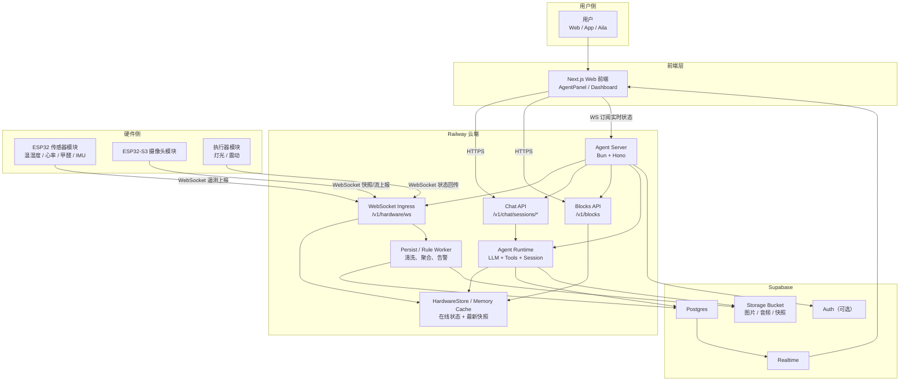
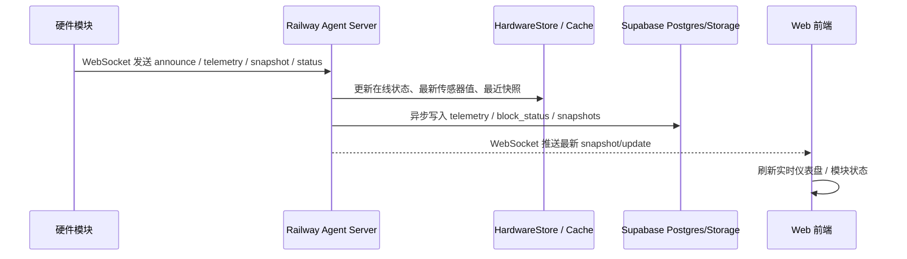
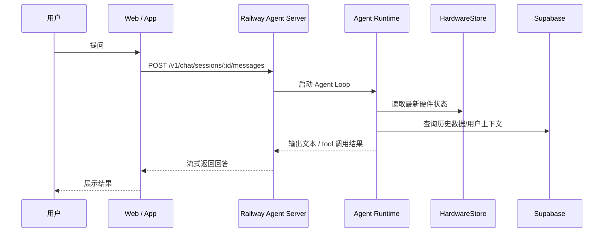
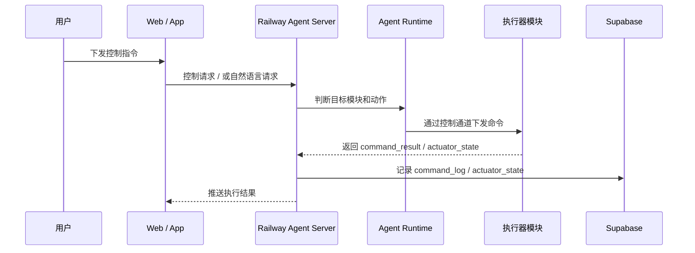
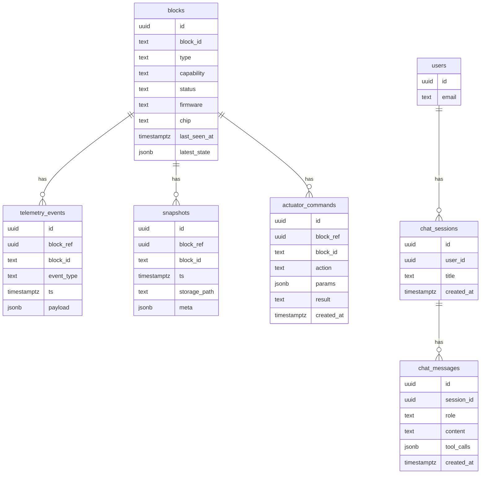

# 项目完整架构图（Supabase + WebSocket + Railway）

> 这份图基于你当前描述的目标架构整理：
> - 数据库使用 Supabase
> - 硬件数据通过 WebSocket 传入云端
> - 后端部署在 Railway
>
> 其中仓库里已经明确存在的是 `Bun + Hono agent server`、`/v1/hardware/ws`、`/v1/blocks`、聊天会话接口和 Web 前端。
> Supabase 持久化部分目前更多是目标架构设计，因此下图里我按“推荐落地形态”补全。

---

## 1. 总体架构图

---

## 2. 核心数据流

### A. 硬件遥测上报链路

### B. 用户提问链路

### C. 执行器控制链路

> 上面这条控制链路里，“Agent Server -> 硬件模块”的控制通道可以继续走 WebSocket，也可以后面替换成 MQTT，不影响整体分层。

---

## 3. 分层说明

### 3.1 硬件层

- ESP32-C3 / ESP32-S3 模块负责采集传感器数据、快照、状态心跳。
- 每个模块至少要有 `block_id`、`type`、`capability`、`timestamp`。
- 建议统一消息类型：
  - `announce`
  - `status`
  - `telemetry`
  - `snapshot`
  - `actuator_state`
  - `command_result`

### 3.2 接入层（Railway 上的 Agent Server）

- 使用 `Bun + Hono` 作为统一云端入口。
- `GET /v1/hardware/ws` 负责接收硬件 WebSocket 消息并向前端广播更新。
- `GET /v1/blocks` 返回当前在线模块和最新状态。
- `POST /v1/chat/sessions/*` 负责用户对话、流式输出和 tool 调用。
- `HardwareStore` 负责保存“当前态”，这是实时读写路径，不应每次都直接查数据库。

### 3.3 智能体层

- `Agent Runtime` 负责：
  - 读取当前硬件状态
  - 查询历史数据
  - 根据用户问题决定是否调用工具
  - 产出最终回答
- 这层直接依赖：
  - `HardwareStore` 中的最新状态
  - Supabase 中的历史数据
  - LLM provider

### 3.4 数据层（Supabase）

- Supabase 负责持久化，不负责高频实时接入本身。
- 推荐拆分：
  - `Postgres`：结构化时序数据、设备状态、命令记录、会话元数据
  - `Storage`：图片快照、音频、较大二进制对象
  - `Realtime`：把关键表更新同步给订阅端
  - `Auth`：如果前端需要用户体系，可以直接接

---

## 4. 建议的数据表

---

## 5. 推荐职责边界

### Railway 负责

- 跑 `agent-server`
- 接 WebSocket 硬件上报
- 维护在线态和最近值缓存
- 对外提供 API / WS
- 跑 Agent Loop 和工具调用
- 把清洗后的数据写入 Supabase

### Supabase 负责

- 存储业务数据和历史记录
- 存储图片/音频等对象
- 提供鉴权和 Realtime 能力

### 前端负责

- 展示实时硬件状态
- 发起聊天请求
- 展示流式 Agent 输出
- 订阅关键状态更新

---

## 6. 最适合你们当前阶段的落地方式

如果你们现在目标是黑客松优先，我建议按下面顺序做：

1. 先保留 `Railway Agent Server` 作为唯一入口。
2. 硬件统一连到 `WebSocket ingress`，先把在线状态和 telemetry 打通。
3. 服务端收到消息后同时做两件事：
   - 写 `HardwareStore`，保证前端和 Agent 能实时读到
   - 异步写 Supabase，保证历史记录可查
4. 前端实时显示优先读 `Railway WS / HardwareStore`，不要每次都从 Supabase 拉。
5. 历史分析、报表、趋势图再查 Supabase。

这样分工的原因很直接：

- `HardwareStore` 适合高频实时态
- `Supabase` 适合持久化和历史查询
- `Railway` 适合承接接入层和 Agent 推理层

---

## 7. 一句话总结

这套架构的核心是：

`硬件通过 WebSocket 把实时数据打到 Railway 上的 Agent Server，Agent Server 一边维护内存里的实时状态，一边异步落库到 Supabase，再把实时状态和智能体能力同时提供给前端和 Agent。`
